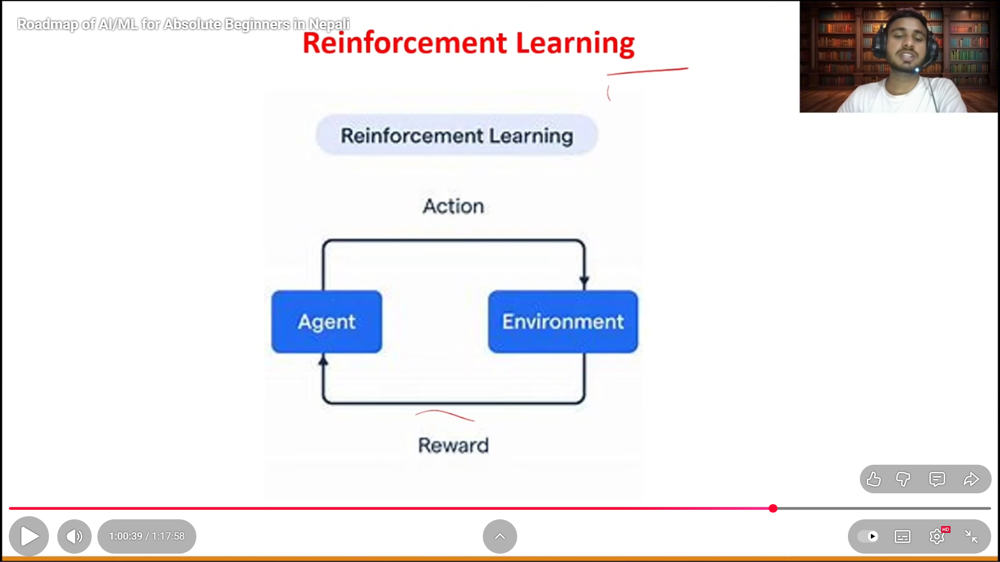
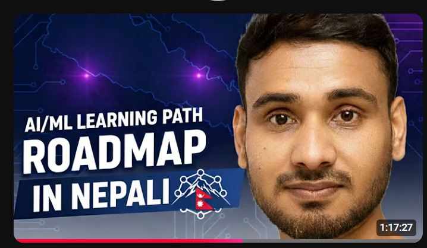

<div align="center">

[](https://git.io/typing-svg)


</div>

---

## 🧑‍💻 About Me

🔥 **AI & ML Engineer** and **Content Creator** passionate about learning and teaching  
🌍 Based in **Nepal** 🇳🇵  
🎓 **Computer Science** background with strong **Mathematics** foundation  
🚀 Learning **Generative AI**, **LLMs**, and **Advanced ML techniques**  
💡 Building projects to solve real-world problems  
📚 Creating educational content for developers and AI enthusiasts  
📊 Making **Statistics**, **Data Science**, and **AI** accessible to everyone  

---

## 📚 Educational Content & Collaborations

<table>
<tr>
<td width="50%">

### 🤖 AI/ML Complete Roadmap
**Collaboration with EverydayKerma**

[](https://www.youtube.com/watch?v=fUYI9TZmIc4&t=2333s)

📹 [Watch the Complete Roadmap Guide](https://www.youtube.com/watch?v=fUYI9TZmIc4&t=2333s)

A comprehensive guide covering:
- 🧠 Machine Learning Fundamentals
- 🤖 Deep Learning & Neural Networks
- 📊 Data Science & Analytics
- 🎯 Career Guidance & Roadmap

</td>
<td width="50%">

### 🚀 SkillCrew Technology
**Technical Collaboration**

[](https://www.youtube.com/watch?v=rI7n-e1kLz8&t=2619s)

📹 [Watch the Technical Session](https://www.youtube.com/watch?v=rI7n-e1kLz8&t=2619s)

Advanced topics including:
- 💻 Software Development Best Practices
- 🛠️ Modern Tech Stack
- 🎓 Professional Skill Development
- 🌐 Industry Insights

</td>
</tr>
</table>

---

## 🎯 Content Focus Areas

<table>
<tr>
<td align="center" width="25%">

### 📊 Statistics & Data Science
Descriptive Statistics  
Inferential Statistics  
Hypothesis Testing  
Data Visualization  
Machine Learning  

</td>
<td align="center" width="25%">

### 🤖 Generative AI & LLMs
Large Language Models  
Prompt Engineering  
RAG Systems  
AI Agents  
Fine-tuning Models  

</td>
<td align="center" width="25%">

### 🚀 Machine Learning
Supervised Learning  
Unsupervised Learning  
Neural Networks  
Model Deployment  
MLOps  

</td>
<td align="center" width="25%">

### 📐 Mathematics for AI/ML
Linear Algebra  
Calculus  
Statistics & Probability  
Discrete Mathematics  
Mathematical Optimization  

</td>
</tr>
</table>

---

## 🛠️ Tech Stack

### 🤖 AI & Machine Learning


### 📊 Data Science & Analytics


### 🧠 Generative AI & LLMs


### 📐 Mathematics & Statistics


### 💻 Programming & Development


### 💾 Databases & Tools


---

## 📊 GitHub Stats

<div align="center">
  
  
</div>

<div align="center">
  
</div>

<div align="center">
  
</div>

---

## 🎯 Currently Working On

<table>
<tr>
<td width="25%" align="center">

### 🚀 AI Projects
Building practical ML solutions

</td>
<td width="25%" align="center">

### 📊 Stats Content
Making statistics fun and accessible

</td>
<td width="25%" align="center">

### 🤖 LLM Tutorials
Exploring Generative AI

</td>
<td width="25%" align="center">

### 🌱 Learning
Advanced ML & Math techniques

</td>
</tr>
</table>

---

## 📈 Content Creation Goals

📚 **Educational Content Mission:**
```
├── 🎯 Make complex AI/ML topics simple and engaging
├── 💡 Provide hands-on, practical examples and projects
├── 🌍 Help developers worldwide learn AI/ML and Data Science
├── 📊 Bridge the gap between theory and practice
├── 🧮 Make Mathematics accessible for AI/ML
└── 🚀 Build a community of learners and builders
```

---

## 🎬 Coming Soon

<table>
<tr>
<td align="center">📊<br/><b>Interactive Statistics<br/>Playground</b></td>
<td align="center">🤖<br/><b>AI Project<br/>Walkthroughs</b></td>
<td align="center">🎥<br/><b>Code-Along<br/>Video Series</b></td>
<td align="center">💼<br/><b>Real-World<br/>Case Studies</b></td>
<td align="center">🧠<br/><b>LLM Deep<br/>Dive Tutorials</b></td>
</tr>
</table>

---

## 🌐 Connect With Me

<div align="center">

[](https://www.linkedin.com/in/anandarimal/)
[](https://twitter.com/ananda_rimal1)
[](https://instagram.com/anandarimal1)
[](https://www.facebook.com/profile.php?id=100078209768946)
[](https://medium.com/@anandarimal)
[](https://github.com/AnandaRimal)

</div>

---

<div align="center">

### 🎯 *"Learning, building, and sharing knowledge in AI & Data Science"*

### 📢 Join my journey of making AI education accessible to everyone!

#### 💬 Always eager to learn and collaborate on AI/ML projects!
#### 🎓 Building educational content that developers actually enjoy!

---


</div>
